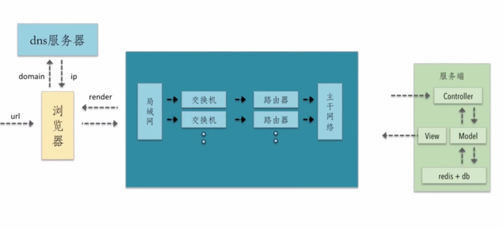
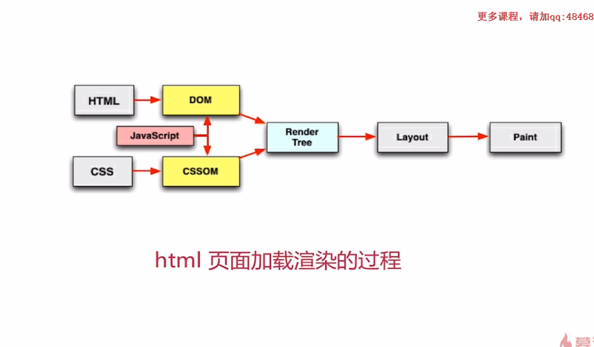
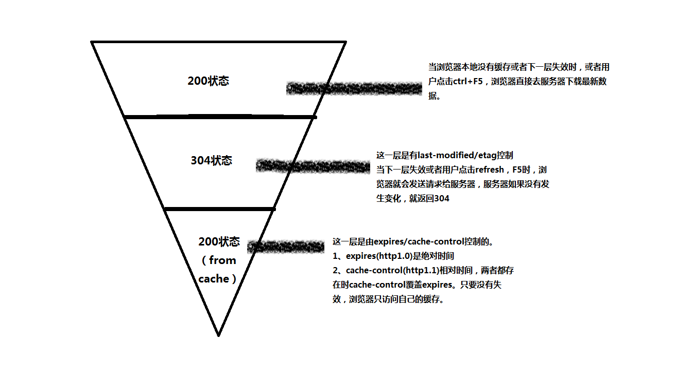

# 前端性能优化


在之前的开发中，经常会接触到前端性能优化的问题，这段时间看了一系列大佬的课程与博客，下面主要对前端性能优化进行一个总结。

## 一、目录

---

* 基础优化
  * 前端优化原理解析
  * HTML优化
  * css优化
  * js优化
  * 图片优化
  * 文件合并优化
* 进阶优化
  * 文件懒加载与预加载
  * 重绘与回流
  * 浏览器缓存
  * 浏览器缓存策略

## 二、基础优化

---

### 1、前端优化原理解析

问题一：一个请求从发出到返回结果经历了什么？



下面是对上图的一个具体的描述：

用户首先在浏览器中输入一个url，浏览器中的核心代码会将url进行拆分解析。浏览器会将domain发送到dns服务器，dns服务器会根据domain查询对应的ip地址，同时将ip地址返回给浏览器，浏览器在持有ip地址之后，就会知道这个请求要发送的地址，就跟随协议，将ip地址打在协议中，并且请求相关的参数都携带，发送到我们的网络中，经过局域网、交换机、路由器、主干网络，之后请求会到达我们的服务端，服务端是MVC架构，请求会首先进入到controller中，在controller中进行相关逻辑的分发，调用model层，model是与数据进行交互的，在数据进行交互中，去拿数据库的数据，最后将我们渲染好的数据通过view层分发到网络中，http请求的response就从服务端又回到了浏览器，浏览器就开始render。

潜在的性能优化点：
* 1、dns缓存
* 2、减少http请求
* 3、减小http请求的大小
* 4、网络请求的时候走最近的网络请求
* 5、浏览器端缓存

问题二：一个网站在浏览器端是如何进行渲染的？



下面是对上图的一个具体的描述：

请求返回一段HTML文档，这一段HTML文档会被浏览器中的HTML parse 这一个解析器进行解析，通过词法分析的过程将tag分析为token，依次从html文档中从上到下去解析token，因为他是用next token的方式不断的从上到下进行解析的，在词法分析的过程中是可以相应的解析出link script这样的标签，这样的标签里面所对应的web资源会进一步的由浏览器向网络发起请求。请求回来的JavaScript web资源会交给浏览器中的v8 JavaScript执行引擎去执行。css相关的资源请求回来之后会由浏览器生成相应的CSSOM树。页面渲染的前提是DOM树和CSSOM树都有了之后，去生成Render tree，进一步进行一个布局，从而进行绘制。

**总结**从上面的两个问题我们可以看出前端性能优化的基础优化的核心就是减少http请求和减小http请求的大小。

### 2、HTML优化

* 原理
* 实现方式

**原理** 压缩包括空格，制表符，换行符等，还有一些其他意义的字符，如HTML注释也可以被压缩。

**实现方式**1、gulp中使用gulp-htmlmin插件进行压缩 2、在线的压缩软件进行压缩（不适用与大的项目）

```js
gulp.task('htmlmin', function() {
   	var options = {
   		removeComments: true, //清除HTML注释
   		collapseWhitespace: true, //压缩HTML
   		collapseBooleanAttributes: true, //省略布尔属性的值 <input checked="true"/> ==> <input />
   		removeEmptyAttributes: true, //删除所有空格作属性值 <input id="" /> ==> <input />
   		removeScriptTypeAttributes: true, //删除<script>的type="text/javascript"
   		removeStyleLinkTypeAttributes: true, //删除<style>和<link>的type="text/css"
   		minifyJS: true, //压缩页面JS
   		minifyCSS: true //压缩页面CSS
   	};
   	var htmlSrc = './src/*.html',
   		htmlDst = './dist';
   	gulp.src(htmlSrc)
   		.pipe(htmlmin(options))
   		.pipe(gulp.dest(htmlDst)); //同名的html,会直接替换
   });
```

### 3、CSS优化

* 原理
* 实现方式

**原理** 无效代码删除、空格删除、制表符删除

**实现方式** 1、gulp中使用gulp-minify-css插件进行压缩 2、在线的压缩软件进行压缩（不适用与大的项目）

### 4、JS优化

* 原理
* 实现方式

**原理** 无效字符的删除、剔除注释、代码语义的缩减和优化、代码保护（将一些具有语义化的名称修改为a/b/c之类的）

**实现方式** 1、gulp中使用gulp-uglify插件进行压缩 2、在线的压缩软件进行压缩（不适用与大的项目）

### 5、图片优化

**图片类型**

* jpg 有损压缩 压缩率高 不支持透明
* png 支持透明 浏览器兼容性好
* webp 压缩程度更好 在iOS webview有兼容性问题
* SVG 矢量图 图片样式相对简单的场景

**解决方法**

* Image Inline（减少http请求的数量）
* 雪碧图（减少http请求的数量）

**实现方法**

* 在线的图片压缩软件
* gulp的gulp-imagemin图片压缩插件

### 6、文件合并与优化

**存在的问题**

* 首屏渲染问题（多个文件合并导致一个http请求过大，请求时间过长）
* 缓存失效问题（合并后任何一个文件的修改都会导致缓存失效）

**解决方法**

* 公共库合并
* 不同页面的合并

**实现方法**

使用gulp的gulp-concat插件进行文件合并。

## 三、进阶优化

---

### 1、文件懒加载与预加载

**懒加载**

* 图片进入可视区域之后请求图片资源
* 对于电商等图片很多，页面很长的业务场景适用
* 减少无效资源的加载
* 并发加载的资源过多会阻塞js的加载，影响网站的正常使用

**预加载**

* 图片等静态资源在使用之前的提前请求
* 资源使用到时能从缓存中加载，提升用户体验
* 页面展示的依赖关系维护

**懒加载实现方法** HTML代码

```html
<!doctype html>
<html lang="en">
<head>
	<meta charset="UTF-8" />
	<title>lazyload</title>
	<link rel="stylesheet" href="main.css" />
</head>
<body>
	<div class="image-list">
		
		
		
		
		
		
		
		
		
		
		
		
		
		
		
		
		
		
		
		
		
		
	</div>
	
	<script type="text/javascript" src="lazyload.js"></script>
</body>
</html>
```

**CSS**

```css
.image-item{
	width: 40%;
	margin-right: 5%;
	display: inline-block;
	height: 400px;
	background: gray;
}

.image-list{
	margin-left: 5%;
}
```

**JS**

```JS
/**
 * 原理 需要比较可视区域的高度和当前图片在区域内的top值来决定是否加载图片
 * Element.getBoundingClientRect()方法返回元素的大小及其相对于视口的位置。
 * 
 * dataset 用于获取某个属性的值
 * */

var viewHeight = document.documentElement.clientHeight;


function lazyload(){
	var eles = document.querySelectorAll('img[data-original][lazyload]');
	Array.prototype.forEach.call(eles,function(item,index){
		var rect;
		if(item.dataset.original === '')
			return;
		rect = item.getBoundingClientRect();
		if(rect.bottom >=0 && rect.top < viewHeight){
			!function(){
				var img = new Image();
				img.src = item.dataset.original;
				img.onload = function(){
					item.src= img.src;
				}
				item.removeAttribute('data-original');
				item.removeAttribute('lazyload');
			}()
		}
	})
}

lazyload();

document.addEventListener('scroll', lazyload);
```

**预加载实现方法**

```js
img标签 + display:none


new Image()
var img =new Image();
img.src="sdsds.png";
```

### 2、重绘与回流

* 问题
* 浏览器重绘与回流机制
* 什么是重绘
* 什么是回流
* 哪些操作能够出现重绘和回流？

问题一：CSS性能让JavaScript变慢？（会）

CSS和JavaScript会相互阻塞（JavaScript可能在代码中获取相关的渲染结果） 一个线程 => JavaScript解析 一个线程 => UI渲染

====所有这两个线程是互斥的====

**总结** 前端性能优化与重绘与回流有关系的原因是：频繁的触发重绘与回流，会导致UI频繁渲染，最终会导致js变慢，会导致页面性能变差。

**回流** 尺寸、布局、隐藏等改变需要重新构建，就称为回流。

触发回流的因素：

* 盒子模型相关属性
* 定位及浮动相关属性
* 节点内部文字结构

**重绘** 外观、风格改变而不影响布局需要重绘

### 3、浏览器缓存

* cookie
* localstroage sessionstorage
* Service Workers

### 4、缓存



* cache-control
* expires
* last-modified
* etag