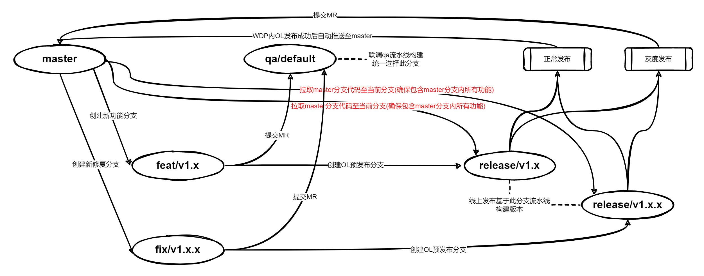

# 分支管理

### 1. 操作准则

* 统一使用Git作为版本管理工具。
* 不允许在qa/default和master分支进行开发
* qa/default分支作为联调验证期间指定构建发布分支，`禁止选择自身feat/v1.x或fix/v1.x.x分支构建发布至联调环境`

### 2. 分支管理流程图

### 3. 常见问题

**(1) 两个人负责开发的功能晚上要一起上线，release分支该如何建？**

答：遇到两个feat/v1.x分支的内容要同时上线时，需要先基于master建立一个release/v1.x分支，然后把两个feat分支内的内容合并到release/v1.x进行发布上线操作

**(2) 为什么要在上线前从master分支拉取代码到自己的release/v1.x分支，有意义吗？**

答：此操作是为了保证自身的release/v1.x分支包含线上的所有功能，避免遗失其他小伙伴近期上线的功能，造成版本落后！

### 4.推荐使用git可视化操作工具SourceTree(支持中文简体)

下载地址：[https://www.sourcetreeapp.com/](https://www.sourcetreeapp.com/)
