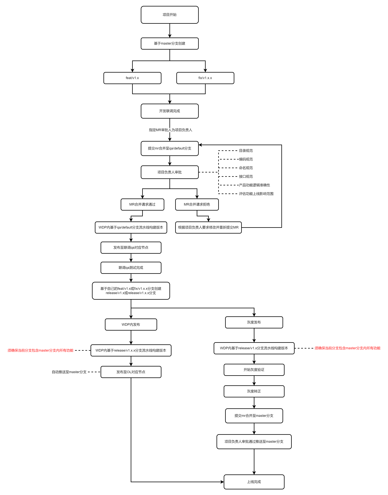
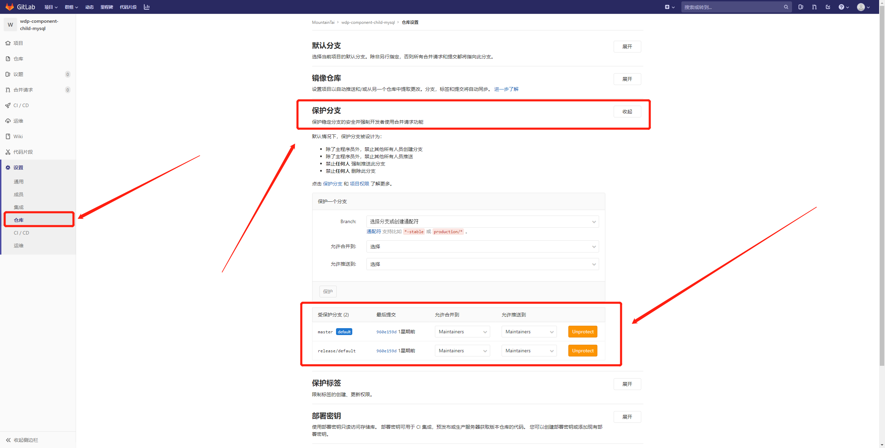
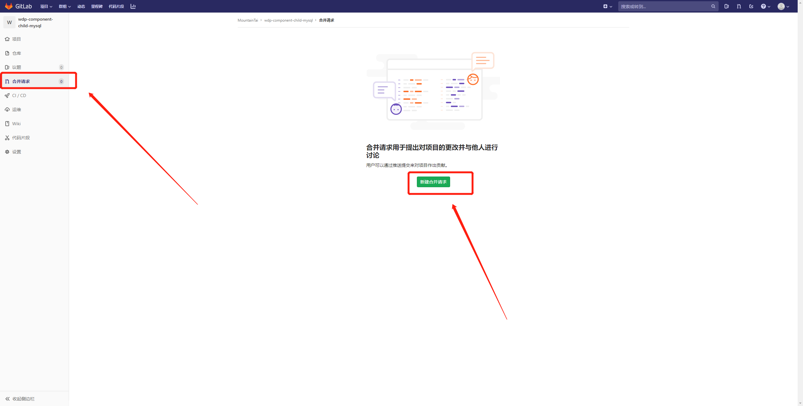
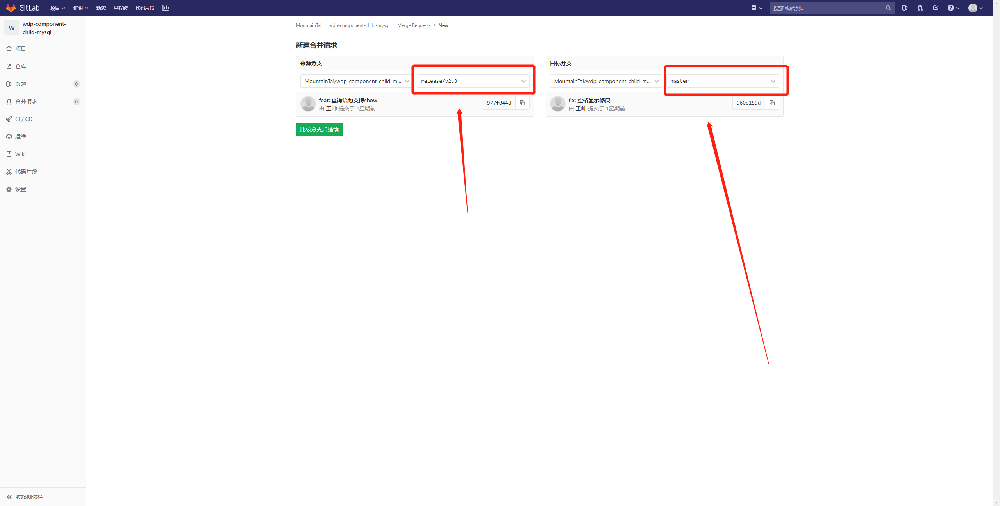
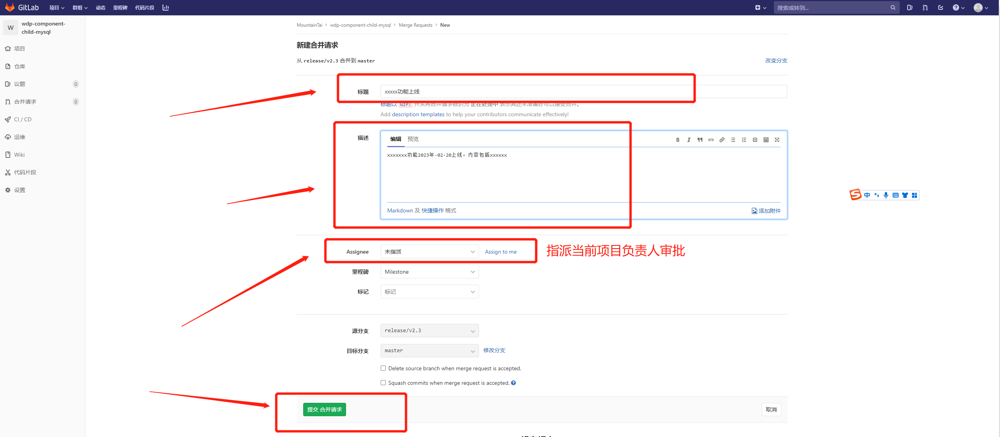
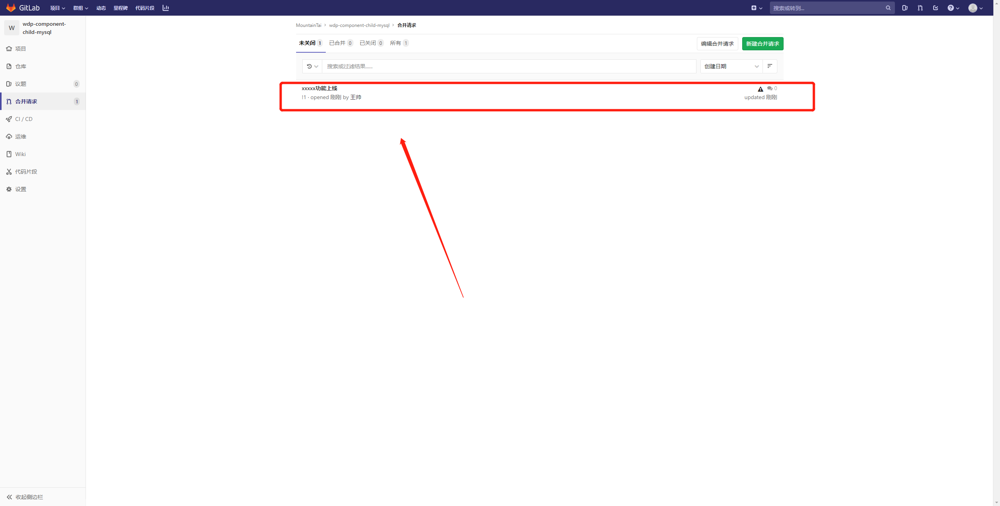

# Merge Requests操作流程

### 1. 使用准则

* master、qa/default分支作为保护分支，非项目负责人只能通过提交mr合并代码

### 2. 操作流程图

### 3. 流程指引

**(1) 作为项目负责人如何配置保护分支？**

答：需设置qa/default、master分支为保护分支，配置方式见下图

**(2) 作为项目参与开发人员如何提交MR？**

答：操作流程见下图

<!-- ## 一、 gitlab Merge Requests配置

**1、确立主分支**

选用`master`分支作为主分支（有些历史项目的主分支可能是release、release/default）

**2、设置保护分支**

## 二、 Merge Requests操作流程

**1、创建mr**

**2、选择mr的分支**

**3、描述本次合并内容**

**4、查看待合并request**

**注意事项：**

在每次提交的时候，记得将master分支和自己的分支先做合并，避免和其他同事近期上线的代码产生冲突 -->