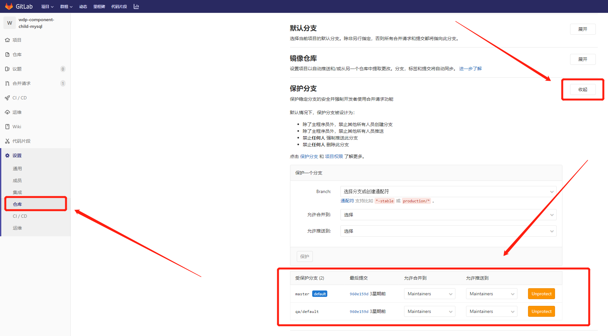

# Merge Requests操作流程

## 一、 gitlab Merge Requests配置

**1、确立主分支**

选用`master`分支作为主分支（有些历史项目的主分支可能是release、release/default）

**2、设置保护分支**

## 二、 Merge Requests操作流程

**1、创建mr**

**2、选择mr的分支**

**3、描述本次合并内容**

**4、查看待合并request**

**注意事项：**

在每次提交的时候，记得将master分支和自己的分支先做合并，避免和其他同事近期上线的代码产生冲突