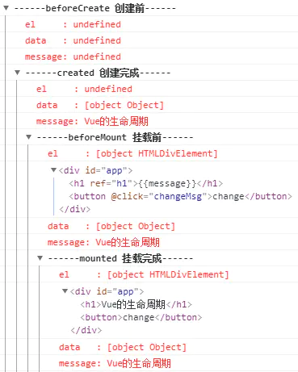
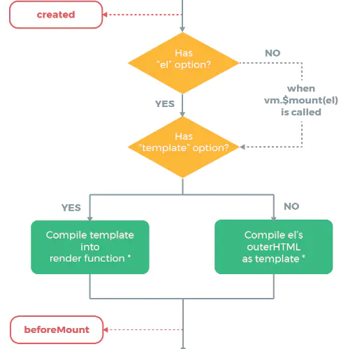
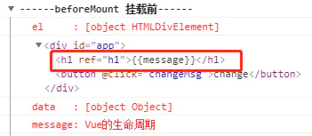
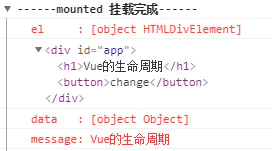
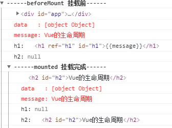
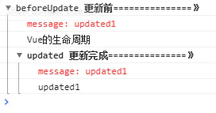
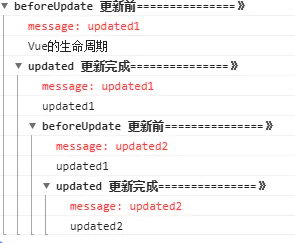
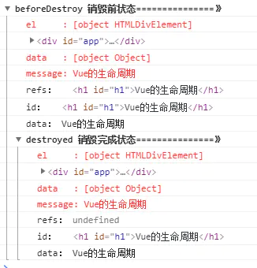

# Vue生命周期

-----

> 每个 Vue 实例在被创建时都要经过一系列的初始化过程——例如，需要设置数据监听、编译模板、将实例挂载到 DOM 并在数据变化时更新DOM等。同时在这个过程中也会运行一些叫做生命周期钩子的函数，这给了用户在不同阶段添加自己的代码的机会


### 一个完整的vue生命周期会经历以下钩子函数

* beforeCreate --- 创建前
* created --- 创建完成
* beforeMount --- 挂载前
* mounted --- 挂载完成
* beforeUpdate --- 更新前
* updated --- 更新完成
* beforeDestroy --- 销毁前
* destroyed --- 销毁完成

### 各个钩子函数在chrome控制台下的打印情况



**下面逐步解读各个钩子函数的步骤**

### beforeCreate -> created
* 初始化vue实例，进行数据观测

### created

* 完成数据观测，属性与方法的运算，watch、event事件回调的配置
* 可调用methods中的方法，访问和修改data数据触发响应式渲染dom，可通过computed和watch完成数据计算
* 此时vm.$el 并没有被创建
* 一般在created中进行ajax请求

### created -> beforeMount



* 判断是否存在el选项，若不存在则停止编译，直到调用vm.$mount(el)才会继续编译
* 若存在el，则判断是否存在template，若存在，则将template编译成render函数；若不存在，则直接编译el所对应的外部html
* 如果存在render函数，则首先对其进行编译
* 此过程中vm.el被实例化为el选项对应DOM元素，所以在beforeMount中，用vm.el获取到的是挂载DOM的HTML

**优先级： render > template > outerHTML**

### beforeMount

* 在此阶段可获取到vm.el
* 此阶段vm.el虽已完成DOM初始化，但并未挂载在el选项上



### beforeMount -> mounted


* 此阶段vm.el完成挂载，vm.$el生成的DOM替换了el选项所对应的DOM*



### mounted

vm.el已完成DOM的挂载与渲染，此刻打印vm.$el，发现之前的挂载点及内容已被替换成新的DOM

**通过实例验证一下**

```js
<div id="app">
    <h1 ref="h1" id="h1">{{message}}</h1>
    <button @click="changeMsg">change</button>
 </div>
 
 var vm = new Vue({
    el: '#app',
    data: {
      message: 'Vue的生命周期'
    },
    template: '<h2 id="h2">{{message}}</h2>',
    beforeMount: function() {
      console.group('------beforeMount 挂载前------');
      console.log(this.$el);
      console.log("%c%s", "color:red","data   : " + this.$data); //已被初始化  
      console.log("%c%s", "color:red","message: " + this.message); //已被初始化  
      let h1 = document.getElementById('h1')
      let h2 = document.getElementById('h2')
      console.log('h1:',h1)
      console.log('h2:',h2)
    },
    mounted: function() {
      console.group('------mounted 挂载完成------');
      console.log(this.$el);
      console.log("%c%s", "color:red","data   : " + this.$data); //已被初始化
      console.log("%c%s", "color:red","message: " + this.message); //已被初始化 
      let h1 = document.getElementById('h1')
      let h2 = document.getElementById('h2')
      console.log('h1:',h1)
      console.log('h2:',h2)
    },
}
```



* 可看出在挂载前，是以初始el与虚拟DOM存在的，template还未被编译到，故h2打印出null
* 而在挂载后，vm.$el完成了对el的替换，并完成了dom的渲染，所以h2打印出挂载渲染后的template，而el被替换，所以h1打印为null

### beforeUpdate

> 当渲染在模板上的data数据更新时，会触发beforeUpdate方法

* 更新的数据必须是被渲染在模板上的（el、template、render之一）
* 此时view层还未更新
* 只有在挂载完成后，才可以触发更新方法（因为挂载完成后才完成模板的渲染，而update则是对模板数据的更新与重新渲染）
* 若在beforeUpdate中再次修改数据，不会再次触发更新方法

### updated

* 完成view层的更新
* 若在updated中再次修改数据，会再次触发更新方法（beforeUpdate、updated）
* 当数据变化后，通过render函数生成VNode，通过patchVNode对比前后变化，diff算法进行更新、添加、删除等操作生成真实的DOM节点

**正常更新操作**

```js
beforeUpdate: function () {
    console.group('beforeUpdate 更新前===============》');
    console.log("%c%s", "color:red","message: " + this.message); 
    console.log(this.$refs.h1.innerHTML)
},
updated: function () {
    console.group('updated 更新完成===============》');
    console.log("%c%s", "color:red","message: " + this.message); 
    console.log(this.$refs.h1.innerHTML)
},
```



* beforeUpdate中还未完成view层的更新，此阶段打印出的innerHTML仍是未修改前的数据
* updated中完成了view层更新，打印的innerHTML为修改后的数据
* 不能直接输出data数据，控制台输出的数据为view层更新后的数据，可改为innerHTML验证

**在updated中修改数据**

```js
beforeUpdate: function () {
    console.group('beforeUpdate 更新前===============》');
    console.log("%c%s", "color:red","message: " + this.message); 
    console.log(this.$refs.h1.innerHTML)
},
updated: function () {
    console.group('updated 更新完成===============》');
    console.log("%c%s", "color:red","message: " + this.message); 
    console.log(this.$refs.h1.innerHTML)
    this.message = 'updated2'
},
```



* 当updated完成数据的更新与view层的渲染后，若修改数据，则会再次触发更新方法

### beforeDestroy
* 实例被销毁前调用，此时实例仍可访问

### destroyed
* 实例被销毁后调用
* 完全销毁一个实例。清理它与其它实例的连接，解绑它的全部指令及事件监听器
* Watcher对象从其所在Dep中释放
* 并不能清除DOM，仅仅销毁实例



* 当beforeDestroy时，实例未被销毁，此时可通过this.$refs访问到该DOM
* 当destroyed后，实例被销毁，此时通过this.$refs访问为null