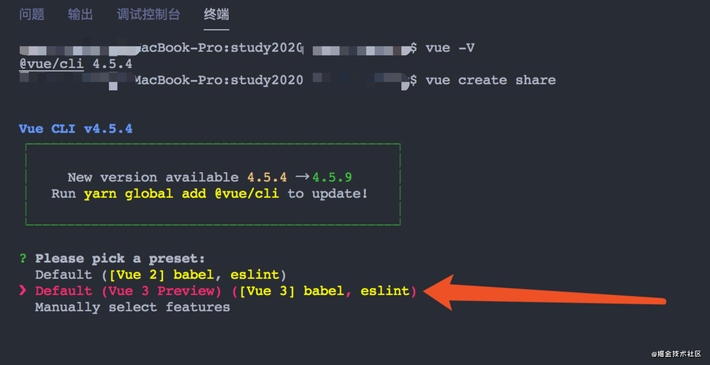

# Vue3.0新特性

----

动机：组合式api更好的逻辑复用与代码组织。

## 安装

------

```js
// 确认脚手架在4.5以上，否则就更新脚手架
1. npm install -g @vue/cli@next

2. vue create projectname

3. 选择vue3版本
```



## 1. setup函数

----

setup函数是vue3中所有api的入口。

```js
export default {
    name: 'XXX',
    components: {},
    ...
    
    setup(props, context) {
    	...
      console.log("context:", context)
    }
		...
}
```

> 取消了created()生命周期函数，vue3.x首先执行props初始化，然后就会先执行setup()。

## 2. ref()和reactive()

---

ref()和reactive()定义变量的时候使用。

* **ref()**
  
  定义单值。

  ```js
  import { ref } from 'vue'
  export default {
    setup() {
      const name = ref('刘亦菲')
    }
  }
  ```

  获取单值。

  ```js
  ...
    const getName = name.value// 敲黑板： ref是一个对象，这里需要XX.value的形式
  ...
  ```

* **reactive()**
  
  定义响应式对象。

  ```js
  import { reactive } from 'vue'
  export default {
    setup() {
      const userInfo = reactive({
      	name: '刘亦菲'
      })
    }
  }
  ```

## 3. toRefs()

---

解构响应式对象数据。主要使用在`reactive()`上，把一个响应式对象转换成普通对象，该普通对象的每个 property 都是一个 ref ，和响应式对象 property 一一对应。

```html
<template>
    <h1>解构响应式对象数据</h1>
    <p>name: {{username}}</p>
    <p>age: {{age}}</p>
</template>
<script>
  import { reactive, toRefs } from 'vue'
  export default {
    setup() {
      const userInfo = reactive({
      	name: '刘亦菲',
        age: 18
      })
      const userInfoRef = toRefs(userInfo)
      return {
      	...userInfoRef
      }
    }
  }
</script>
```

## 4.v-model多个值变化

---

* 给子组件传输多个变量。

```html
  <!-- 父组件 -->
  <my-child v-model:username="username" v-model:age="age"></my-child>
  
  
  <!-- 子组件 -->
  <template>
    <div class="page">
      <label>姓名：<input type="text" :value="username" @input="inputNameChange"></label>
      <label>年龄：<input type="text" :value="age" @input="inputAgeChange"></label>
    </div>
  </template
  <script>
    export default {
      props: ['username','age'],
      setup(props,context) {
        const inputNameChange = (e) => {
          context.emit('update:username', e.target.value)
        }
        const inputAgeChange= (e) => {
          context.emit('update:age', e.target.value)
        }
        return {
          inputNameChange,
          inputAgeChange
        }
      }
    }
  </script>
```

## 5.computed计算属性

---

```js
const data = reactive({
 age: 20
});

// 函数式
const fakeAge = computed(() => {
 return data.age - 10
});

return { fakeAge };
```

## 6.watch变化

---

```js
// 侦听一个
const state = reactive({ count: 0 })
watch(
  () => state.count,
  (count, prevCount) => {
    ...
  }
)

// 直接侦听一个ref
const count = ref(0)
watch(count, (count, prevCount) => {
 ...
})
```

## 7.watchEffect

---

立即执行传入的一个函数，并响应式追踪其依赖，并在其依赖变更时重新运行该函数。

```js
import { watchEffect } from 'vue'
export default {
  setup({
    ...
    watchEffect('传入一个函数') // 立即执行
  })
}
```

**demo**

```js
import { toRefs, reactive, watchEffect } from 'vue'
export default {
 setup () {
   const data = reactive({
     count: 1,
     total: 999
   })
   const refData = toRefs(data)

   /**
   	1. 传入的函数立即执行
   	2. 当watchEffect传入的函数依赖值有变化时，会再次触发watchEffect函数
   */
   watchEffect(() => {
     console.log(data.count)
   })
   setTimeout(() => {
     data.count = data.count + 2 // 【会】触发watchEffect函数
     data.total = data.total + 2 // 【不会】触发watchEffect函数
   }, 2000)
   return {
     ...refData
   }
 }
}
```

* **停止侦听**

1. 显示停止

```js
import { toRefs, reactive, watchEffect } from 'vue'
export default {
  setup () {
    ...
    const watchFuntion = watchEffect(() => { // 1. 侦听函数
      console.log(data.count)
    })
    
    setInterval(() => {
      data.count = data.count + 1000
    }, 2000)
    
    // 5秒后执行
    setTimeout(() => {
      console.log('停止侦听')
      watchFuntion() // 2. 调用时，停止侦听
    }, 5000)
    return {
      ...refData
    }
  }
}
```

2. 隐式停止：当watchEffect在组件的setup()函数或生命周期钩子被调用时,侦听器会被链接到该组件的生命周期,并在组件卸载时自动停止。（比如：页面关闭的时候，或者切换页面的时候）

## 8.keyCode不生效

----

```html
<!-- 不生效 -->
<input type="text" @keyup.13="doSomething">

<!-- 生效 -->
<input type="text" @keyup.enter="doSomething">
```

## 9.片段

---

在 Vue 3 中，组件现在正式支持多根节点组件，即片段！

```html
<!-- Layout.vue -->
<template>
<!-- div包裹起来消除警告 -->
  <div>
    <header>...</header>
    <main>...</main>
    <footer>...</footer>
  </div>
</template>
```

**3.x**

```html
<!-- Layout.vue -->
<template>
  <header>...</header>
  <main>...</main>
  <footer>...</footer>
</template>
```

## 10.readonly

---

传入一个对象，该对象不可以修改,返回一个原始对象的**只读**代理(深层代理)。

```js
// readonly('传入一个对象或者一个ref') // 因为ref返回的是一个对象
import { reactive, toRefs, readonly } from 'vue'
export default {
  setup () {
    const data = reactive({
      count: 0
    })
    const copy = readonly(data)
    const refData = toRefs(data)
    data.count = 111
    copy.count = 222 // 报错：Cannot assign to 'count' because it is a read-only 
    console.log('copy:', copy.count)
    console.log('data.count:', data.count)
    return {
      ...refData
    }
  }
}
```

## 11.vue-router区别

---

* **安装**

```js
npm install vue-router@next // 4.0+
```

* **使用路由**

```js
// 引用
import { createRouter, createWebHashHistory } from  'vue-router'

//创建
const router = createRouter({
  routes: [
  	...
  ]
})
  
// use使用
 createApp(App).use(router)
```

* **常用API**

```js
import {useRoute, useRouter} from 'vue-router'
const route = useRoute(); // 相当于 vue2 中的this.$route
const router = useRouter(); // 相当于 vue2 中的this.$router
```

## 12.teleport 瞬间移动

---

* **使用**

```html
<teleport to="将当前组件放置在哪个容器内，接受参数字符串"></teleport>
```

* **举例**

```html

<!-- 弹框组件 -->
<template>
	<!-- 重点1: 放置在id为model的容器内 -->
  <teleport to="#model">
    <div class="model" v-if="isOpen">
      <h1>我是弹框内容</h1>
      <button @click="onCloseModel">关闭弹框</button>
    </div>
  </teleport>
</template>

<script lang='ts'>
export default {
  name: 'model',
  props: {
    isOpen: Boolean
  },
  //  重点2:emits中使用的方法名称必须是‘a-b’横杠格式
  emits: {
    'close-model': null
  },
  setup (props, context) {
    const onCloseModel = () => {
      context.emit('close-model')
    }
    return {
      onCloseModel
    }
  }
}
</script>
```

```html
<!-- 使用被teleport包裹的组件 -->
<template>
<!-- 重点3:使用组件 -->
  <model :isOpen="isOpenModel" @close-model="closeModel"></model>
  <button @click="openModelClick">打开弹框</button>
  <div class="page">
    x:{{x}} y:{{y}}
  </div>
</template>

<script lang='ts'>
import { ref, toRefs, reactive, onMounted, onUnmounted } from 'vue'
import model from '../components/Model.vue'
export default {
  name: 'Index',
  components: {
    model
  },
  setup () {

    // 弹框 (teleport学习)
    const isOpenModel = ref(false)
    const openModelClick = () => {
      isOpenModel.value = true
    }
    const closeModel = () => {
      isOpenModel.value = false
    }
    return {
      isOpenModel,
      openModelClick,
      closeModel
    }
  }
}
</script>

<style scoped>
</style>
```

```html
<!-- app.vue -->
<template>
	<div id="#app"></div>
	<div id="#model">
    <!--重点4:  model组件会渲染到这里 -->
  </div>
</template>
```